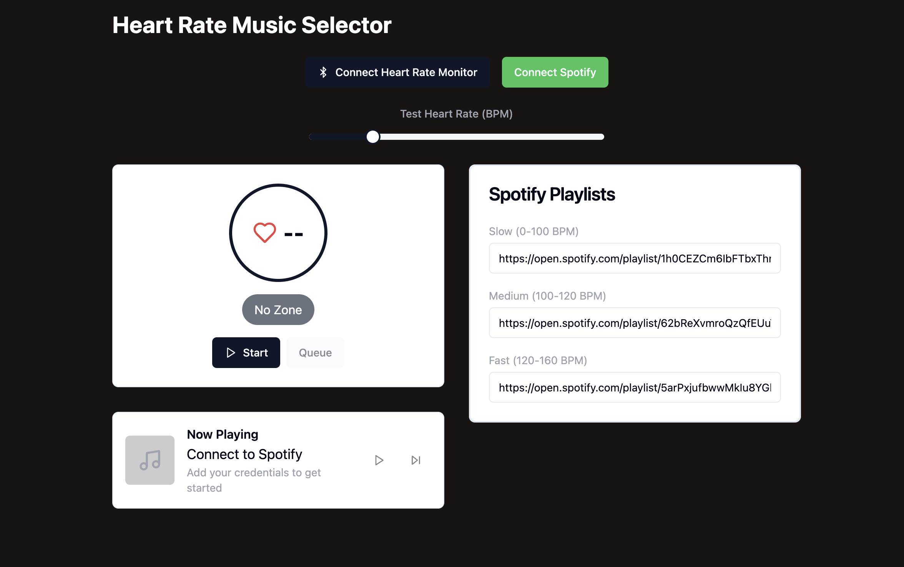
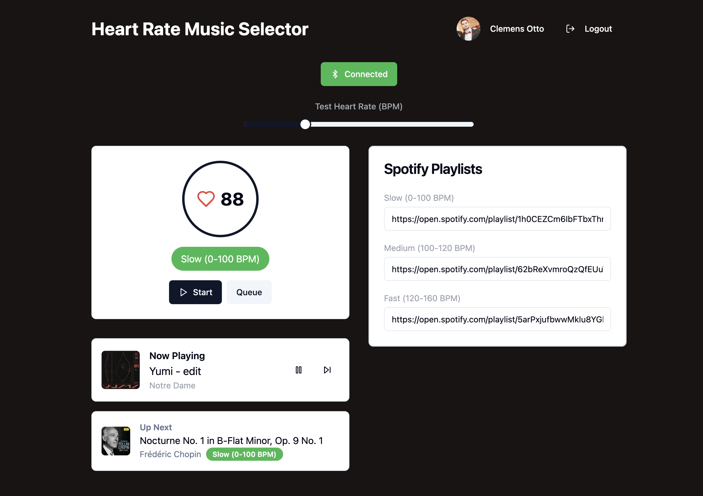

# Heart Rate Music Selector

COM503: Cloudservice Prototyp

Konzept: Integration von Herzfrequenzdaten in die Musikauswahl (Katrin Hinterdorfer, BA)

Gruppenmitglieder:

- Clemens Otto
- Katrin Hinterdorfer
- Sabine Köck


Demo: [https://heart-rate-music-selection.clemens.page](https://heart-rate-music-selection.clemens.page)

(Note: Spotify users must be whitelisted to access the app in development mode.)



A dynamic music player that automatically selects and queues songs from Spotify playlists based on your heart rate. The application adapts your music to your workout intensity in real-time.



## Overview

This application connects to both a heart rate monitor (via Bluetooth) and Spotify to create a seamless workout experience. It automatically selects and queues songs that match your current exercise intensity based on your heart rate.

### Core Features

- **Heart Rate Monitoring**: Connects to Bluetooth heart rate monitors to track your current BPM
- **Dynamic Zone Detection**: Automatically categorizes your activity into three intensity zones:
  - Slow Zone (0-100 BPM)
  - Medium Zone (100-120 BPM)
  - Fast Zone (120-160 BPM)
- **Spotify Integration**: Automatically queues songs from different playlists based on your current heart rate zone
- **Auto DJ**: Intelligently queues songs that match your current workout intensity
- **Test Mode**: Includes a heart rate simulator slider for testing different scenarios

### Technical Architecture

#### Frontend Components

1. **HeartRateDisplay**
   - Displays current heart rate and zone information
   - Shows visual indicators for different intensity zones
   - Includes Auto DJ toggle functionality

2. **BluetoothConnect**
   - Manages Bluetooth device connection
   - Handles heart rate monitor pairing
   - Provides real-time heart rate updates

3. **NowPlaying**
   - Shows currently playing track information
   - Displays upcoming song with its corresponding zone
   - Provides playback controls (play/pause, skip)

4. **PlaylistManager**
   - Manages Spotify playlist configuration
   - Allows setting different playlists for each heart rate zone
   - Validates and displays playlist information

#### Core Logic

1. **Heart Rate Processing**
   - Continuously monitors heart rate data
   - Determines current activity zone
   - Triggers playlist changes when crossing zone boundaries

2. **Spotify Integration**
   - Handles Spotify authentication
   - Manages playlist fetching and track queueing
   - Controls playback state

3. **Queue Management**
   - Selects appropriate songs based on current zone
   - Manages the "Up Next" functionality
   - Handles automatic song queueing

### Technologies Used

- **Frontend Framework**: React with TypeScript
- **Build Tool**: Vite
- **Styling**: 
  - Tailwind CSS for responsive design
  - shadcn/ui for UI components
- **State Management**: React Query for API state
- **APIs and Integration**:
  - Web Bluetooth API for heart rate monitoring
  - Spotify Web API for music playback
- **Authentication**: OAuth 2.0 for Spotify integration

### Project Structure

```
src/
├── components/           # React components
│   ├── BluetoothConnect # Bluetooth connection handling
│   ├── HeartRateDisplay # Heart rate visualization
│   ├── NowPlaying      # Music player interface
│   └── PlaylistManager # Playlist configuration
├── hooks/               # Custom React hooks
│   ├── usePlaybackControls   # Spotify playback logic
│   ├── useQueueManagement    # Song queue handling
│   └── useSpotifyConnection  # Spotify authentication
├── utils/               # Utility functions
│   ├── heartRateZones  # Zone calculation logic
│   └── spotify         # Spotify API helpers
└── pages/              # Application pages
```

## Getting Started

### Prerequisites

- Node.js, npm, bun installed
- A Spotify Premium account
- Spotify Developer App Credentials
- Optional: A Bluetooth heart rate monitor (includes test mode)

### Configuration

1. Connect your heart rate monitor via Bluetooth
2. Authenticate with Spotify
3. Configure playlists for each zone:
   - Slow (0-100 BPM)
   - Medium (100-120 BPM)
   - Fast (120-160 BPM)
4. Enable Auto DJ to start automatic song selection

## Deployment

### Spotify App API Callback

Redirect URIs

- http://localhost:8080/callback
- https://heart-rate-music-selection.clemens.page/callback

### Development Setup

```sh
# Clone the repository
git clone https://github.com/cleot/heart-rate-music-selection.git

# Install dependencies
bun install

# copy env
cp .env.example .env

# add credentials

VITE_SPOTIFY_CLIENT_ID=your_spotify_client_id
VITE_SPOTIFY_CLIENT_SECRET=your_spotify_client_secret


# Start development server
npm run dev
```


### Production Setup


#### Cloudflare Pages

Build configuration

- Framework preset: React (Vite)
- Build command: npm run build
- Build output directory: dist

Variables and Secrets

- VITE_SPOTIFY_CLIENT_SECRET
- VITE_SPOTIFY_CLIENT_ID


## Tools

- lovable.dev (based on GPT Engineer)
- ChatGPT-o1
- Cloudflare Pages